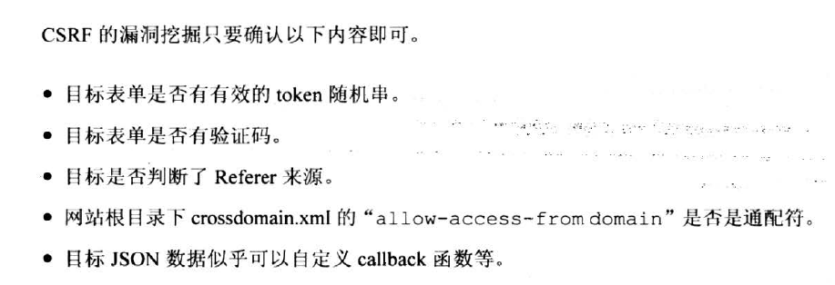
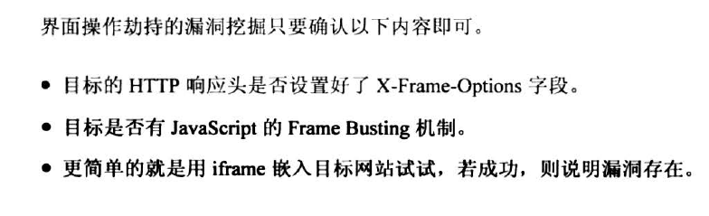

## 大纲
* XSS攻击
* CXRF攻击
* 界面操作劫持
* 漏洞挖掘
* 目前前端项目
* 推荐书籍

### XSS攻击
主要是注入脚本，如论坛里面用户输入``，页面回显的时候如果没有处理js脚本，就可能造成攻击。angular的$sce就是用来处理XSS攻击的。``

1. HTML中代码注入技巧(196页)
    * 标签注入
    * 属性注入
    * HTML事件
2. CSS代码注入技巧(209页)
    * CSS资源类属性
    * IE独有的expression
3. 更多经典的混淆CheckList(221页)
4. 例子
    * 浏览器记住密码(235)
    *

**能被我们利用插入XSS脚本的地方只有css资源类属性值和@import规则，以及IE浏览器下执行的属性值expression**

### CXRF攻击
[栗子](http://www.cnblogs.com/hyddd/archive/2009/04/09/1432744.html)

### 界面操作劫持
[栗子](http://blog.csdn.net/c2iekqea/article/details/55684701)

### 漏洞挖掘

1. csrf漏洞挖掘

    

2. 界面操作劫持漏洞挖掘

    

### 目前前端项目

目前是基于Angular的工程。使用webpack对js代码进行加密，混淆，中文Base64处理。

1. [Angular安全](https://angular.cn/guide/security)
    * bypassSecurityTrustHtml
    * bypassSecurityTrustScript
    * bypassSecurityTrustStyle
    * bypassSecurityTrustUrl
    * bypassSecurityTrustResourceUrl
2. [Angular安全：xsrf-防护](https://angular.cn/guide/http#安全：xsrf-防护)
2. [Angular安全：xssi-防护](https://angular.cn/guide/security#xssi)
3. [Angularjs xss防护：$sce服务](https://docs.angularjs.org/api/ng/service/$sce#use-the-latest-angularjs-possible)
    * trustAsHtml(value)
    * trustAsCss(value)
    * trustAsUrl(value)
    * trustAsResourceUrl(value)
    * trustAsJs(value)

### 书籍

1. [Web前端黑客技术揭秘](https://item.jd.com/12878817351.html) [Web前端黑客技术揭秘(视频)](https://ke.qq.com/course/133640)
2. [白帽子讲Web安全](https://item.jd.com/11483966.html)
3. [白帽子讲Web扫描](https://item.jd.com/15503446687.html)
