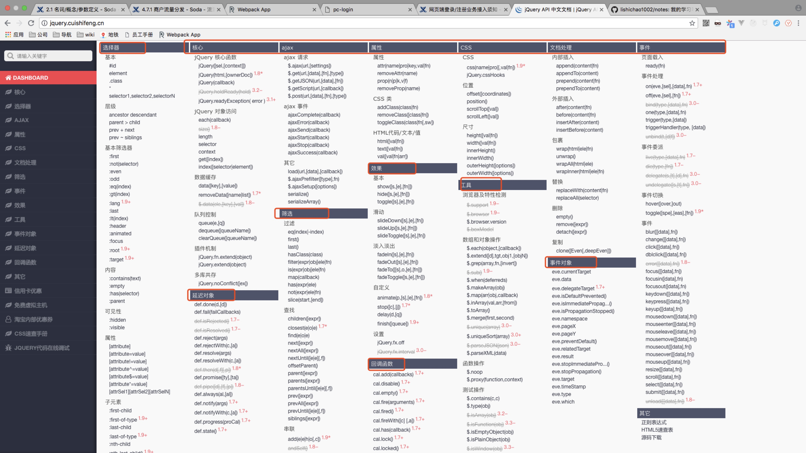

#### 必看(面试、工作直接会用到)
* html
  * 传智播客视频教程百度云 https://pan.baidu.com/s/1i5oXHjv 原文链接 http://yun.itheima.com/course/183.html
* css
* js基础
* jquery http://jquery.cuishifeng.cn/

  
* es6、es7 http://es6.ruanyifeng.com/
* typescript https://www.tslang.cn/docs/home.html
* 设计模式
  * 暂时只看这几种：观察者模式、单例模式、责任链模式、工厂方法模式
* npm / yarn https://www.npmjs.com.cn/ https://yarn.bootcss.com/
* webpack https://www.webpackjs.com/concepts/
* 看vue，有精力的话读一下angular、react的官网语法文档(只需要读一遍就行，不需要细看，后面我给你对比)
* git、svn  https://www.liaoxuefeng.com/wiki/0013739516305929606dd18361248578c67b8067c8c017b000   https://legacy.gitbook.com/book/bingohuang/progit2/details
* linux https://legacy.gitbook.com/book/wizardforcel/vbird-linux-basic-4e/details

#### 高级(可以在工作中慢慢学习、走技术路线的话得看)

* rxjs https://cn.rx.js.org/manual/index.html

* 前端性能优化的，谷歌官网链接，需要翻墙才能访问。https://github.com/lishichao1002/notes/blob/master/performance.md

* 24种设计模式

* JavaScript函数式编程 https://legacy.gitbook.com/book/llh911001/mostly-adequate-guide-chinese/details

* javascript api可用性设计 https://www.smashingmagazine.com/2012/10/designing-javascript-apis-usability/

#### 前端最全的资料，包含计划所有前端设计的东西，需要自己去选择学什么

前端开发人员手册2018年 https://github.com/FrontendMasters/front-end-handbook-2018

